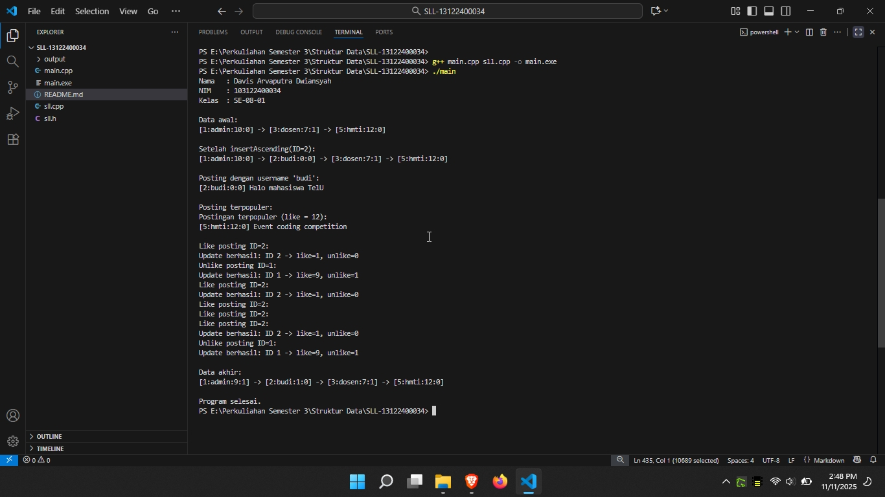

[Praktikum Struktur Data - Single Linked List (MyTelU Timeline)]

Identitas Pengumpul

Nama: Davis Arvaputra Dwiansyah
NIM: 103122400034
Kelas: SE-08-01


1. Kode Program

Berikut adalah kode program untuk simulasi **timeline MyTelU** menggunakan **struktur data Single Linked List (SLL)**.  
Program ini dapat menambahkan postingan, menampilkan berdasarkan username, mencari posting terpopuler, dan mengubah jumlah like/unlike.

File: sll.h
 * Author: Davis Arvaputra Dwiansyah
 * NIM: 103122400034
 * Deskripsi: Program simulasi timeline MyTelU dengan struktur data Single Linked List.
 */

```
#ifndef SLL_H
#define SLL_H

#include <iostream>
#include <stdlib.h>
#include <string>

#define first(L) (L).first
#define next(P) (P)->next
#define info(P) (P)->info
#define NIL NULL

using namespace std;

//deklarasi struct infotype
typedef struct Infotype {
    int ID;
    string content;
    int like;
    int unlike;
    string username;
} infotype;

//deklarasi struct linked list
typedef struct Node *address;
typedef struct Node {
    infotype info;
    address next;
} Node;

typedef struct {
    address first;
} List;

//deklarasi subprogram (sesuai template)
address newElement(infotype data);
void createNewLList(List &a);
bool isEmpty(List a);
void insertFirst(List &a, address p);
void insertAfter(List &a, infotype x, address p);
void insertLast(List &a, address p);
void deleteFirst(List &a, address p);
void deleteLast(List &a, address p);
int length(List a);
address findElement(List a, infotype x);
void printList(List a);

//deklarasi subprogram split list
void splitList(List a, List &oddList, List &evenList);

// deklarasi fungsi untuk soal a-d
void insertAscending(List &a, address p);                   
void printByUsername(List a, const string &username);        
void printTopPopular(List a);                                
void updateLike(List &a, int ID, bool isLike);                

#endif

```

File sll.cpp

```
#include "sll.h"


address newElement(infotype data){
    address p = new Node;
    info(p) = data;
    next(p) = NIL;
    return p;
}

void createNewLList(List &a){
    first(a) = NIL;
}

bool isEmpty(List a){
    return first(a) == NIL;
}

//Silahkan uncomment untuk meja NIM ganjil
void insertFirst(List &a, address p){
    if (p == NIL) return;
    if (isEmpty(a)){
        first(a) = p;
        next(p) = NIL;
    } else {
        next(p) = first(a);
        first(a) = p;
    }
}

void insertAfter(List &a, infotype x, address p){
    if (p == NIL) return;
    address q = first(a);
    while (q != NIL){
        if (info(q).ID == x.ID){
            next(p) = next(q);
            next(q) = p;
            return;
        }
        q = next(q);
    }
}

void insertLast(List &a, address p){
    if (p == NIL) return;
    if (isEmpty(a)){
        first(a) = p;
        next(p) = NIL;
    } else {
        address q = first(a);
        while (next(q) != NIL){
            q = next(q);
        }
        next(q) = p;
        next(p) = NIL;
    }
}

void deleteFirst(List &a, address p){
    if (isEmpty(a)){
        p = NIL;
        return;
    }
    p = first(a);
    first(a) = next(p);
    next(p) = NIL;
}

void deleteLast(List &a, address p){
    if (isEmpty(a)){
        p = NIL;
        return;
    }
    if (next(first(a)) == NIL){
        p = first(a);
        first(a) = NIL;
        next(p) = NIL;
        return;
    }
    address q = first(a);
    while (next(next(q)) != NIL){
        q = next(q);
    }
    p = next(q);
    next(q) = NIL;
    next(p) = NIL;
}

int length(List a){
    int jml = 0;
    address p = first(a);
    while (p != NIL){
        jml++;
        p = next(p);
    }
    return jml;
}

address findElement(List a, infotype x){
    address p = first(a);
    while (p != NIL){
        if (info(p).ID == x.ID) return p;
        p = next(p);
    }
    return NIL;
}

void printList(List a){
    address p = first(a);
    if (p == NIL){
        cout << "List kosong." << endl;
        return;
    }
    while (p != NIL){
        cout << "[" << info(p).ID << ":" << info(p).username
             << ":" << info(p).like << ":" << info(p).unlike << "]";
        if (next(p) != NIL) cout << " -> ";
        p = next(p);
    }
    cout << endl;
}

void splitList(List a, List &oddList, List &evenList){
    createNewLList(oddList);
    createNewLList(evenList);
    address p = first(a);
    while (p != NIL){
        infotype d = info(p);
        address copy = newElement(d);
        if ((d.ID % 2) == 0) insertLast(evenList, copy);
        else insertLast(oddList, copy);
        p = next(p);
    }
}


void insertAscending(List &a, address p){
    if (p == NIL) return;
    if (isEmpty(a)){
        first(a) = p;
        next(p) = NIL;
        return;
    }
    if (info(p).ID < info(first(a)).ID){
        next(p) = first(a);
        first(a) = p;
        return;
    }
    address q = first(a);
    while (next(q) != NIL && info(next(q)).ID < info(p).ID){
        q = next(q);
    }
    next(p) = next(q);
    next(q) = p;
}

void printByUsername(List a, const string &username){
    address p = first(a);
    bool ada = false;
    while (p != NIL){
        if (info(p).username == username){
            cout << "[" << info(p).ID << ":" << info(p).username
                 << ":" << info(p).like << ":" << info(p).unlike << "] ";
            cout << info(p).content << endl;
            ada = true;
        }
        p = next(p);
    }
    if (!ada){
        cout << "Tidak ada postingan untuk username: " << username << endl;
    }
}

void printTopPopular(List a){
    if (isEmpty(a)){
        cout << "List kosong." << endl;
        return;
    }
    int maxLike = info(first(a)).like;
    address p = first(a);
    while (p != NIL){
        if (info(p).like > maxLike) maxLike = info(p).like;
        p = next(p);
    }
    cout << "Postingan terpopuler (like = " << maxLike << "):" << endl;
    p = first(a);
    while (p != NIL){
        if (info(p).like == maxLike){
            cout << "[" << info(p).ID << ":" << info(p).username
                 << ":" << info(p).like << ":" << info(p).unlike << "] ";
            cout << info(p).content << endl;
        }
        p = next(p);
    }
}


void updateLike(List &a, int ID, bool isLike){
    infotype key; key.ID = ID;
    address p = findElement(a, key);
    if (p == NIL){
        cout << "Posting dengan ID " << ID << " tidak ditemukan." << endl;
        return;
    }
    if (isLike){
        info(p).like = info(p).like + 1;
        if (info(p).unlike > 0) info(p).unlike = info(p).unlike - 1;
    } else {
        info(p).unlike = info(p).unlike + 1;
        if (info(p).like > 0) info(p).like = info(p).like - 1;
    }
    cout << "Update berhasil: ID " << ID
         << " -> like=" << info(p).like
         << ", unlike=" << info(p).unlike << endl;
}
```

File main.cpp

```

#include "sll.h"
#include <iostream>
using namespace std;

int main(){
    cout << "Nama   : Davis Arvaputra Dwiansyah" << endl;
    cout << "NIM    : 103122400034" << endl;
    cout << "Kelas  : SE-08-01" << endl << endl;

    // buat list kosong
    List L;
    createNewLList(L);

    // tambahkan data contoh
    infotype a, b, c;
    a.ID = 1; a.content = "Selamat datang di MyTelU"; a.like = 10; a.unlike = 0; a.username = "admin";
    b.ID = 3; b.content = "Pengumuman UTS minggu depan"; b.like = 7; b.unlike = 1; b.username = "dosen";
    c.ID = 5; c.content = "Event coding competition"; c.like = 12; c.unlike = 0; c.username = "hmti";

    insertLast(L, newElement(a));
    insertLast(L, newElement(b));
    insertLast(L, newElement(c));

    cout << "Data awal:" << endl;
    printList(L);
    cout << endl;

    // a. tambah posting secara ascending
    infotype d;
    d.ID = 2; d.content = "Halo mahasiswa TelU"; d.like = 0; d.unlike = 0; d.username = "budi";
    insertAscending(L, newElement(d));

    cout << "Setelah insertAscending(ID=2):" << endl;
    printList(L);
    cout << endl;

    // b. tampilkan posting berdasarkan username
    cout << "Posting dengan username 'budi':" << endl;
    printByUsername(L, "budi");
    cout << endl;

    // c. tampilkan posting terpopuler
    cout << "Posting terpopuler:" << endl;
    printTopPopular(L);
    cout << endl;

    // d. ubah jumlah like dan unlike
    cout << "Like posting ID=2:" << endl;
    updateLike(L, 2, true);

    cout << "Unlike posting ID=1:" << endl;
    updateLike(L, 1, false);
    cout << endl;

    // tampilkan hasil akhir
    cout << "Data akhir:" << endl;
    printList(L);
    cout << endl;

    cout << "Program selesai." << endl;
    return 0;
}

```

2. Penjelasan Kode

Berikut penjelasan alur logika dari program di atas:

**Header dan Struct**

* `sll.h` berisi deklarasi struct `infotype`, struct `Node`, dan struct `List`.
* `infotype` menyimpan data posting (ID, konten, like, unlike, username).
* `Node` berisi `info` dan pointer `next`.
* `List` memiliki pointer `first` yang menunjuk ke elemen pertama.

**Fungsi Utama:**

1. `insertAscending()`
   → Menyisipkan postingan baru agar list tetap terurut berdasarkan ID.
2. `printByUsername()`
   → Menampilkan semua posting yang dimiliki oleh username tertentu.
3. `printTopPopular()`
   → Menampilkan posting dengan jumlah like terbanyak.
4. `updateLike()`
   → Menambah atau mengurangi jumlah like/unlike pada posting tertentu.

**Fungsi Pendukung:**

* `newElement()` membuat node baru.
* `createNewLList()` membuat list kosong.
* `insertLast()` menambahkan node di akhir.
* `printList()` menampilkan seluruh data posting dalam satu baris.


3. Output Program

Berikut hasil eksekusi program ketika dijalankan:




4. Penjelasan Lanjutan (Analisis Output)

**Soal (a):**
Fungsi `insertAscending()` berhasil menempatkan postingan baru dengan ID=2 di posisi yang benar, sehingga list menjadi urut berdasarkan ID.

**Soal (b):**
Fungsi `printByUsername()` menampilkan semua posting milik username `"budi"`.

**Soal (c):**
Fungsi `printTopPopular()` berhasil menampilkan postingan dengan jumlah like terbanyak (ID=5, milik `hmti`).

**Soal (d):**
Fungsi `updateLike()` berhasil memperbarui jumlah like/unlike:

* ID=2 → like bertambah 1
* ID=1 → unlike bertambah 1, like berkurang 1

Seluruh fungsi berjalan sesuai instruksi soal praktikum.


5. Kesimpulan

Berdasarkan hasil uji dan analisis di atas, dapat disimpulkan bahwa:

* Struktur data **Single Linked List** dapat digunakan untuk menyimpan dan mengelola data postingan.
* Seluruh subprogram a–d telah berfungsi dengan benar.
* Program berjalan dengan baik, output sesuai dengan yang diharapkan, dan mudah dipahami.

Dengan demikian, tugas ini **berhasil memenuhi spesifikasi praktikum struktur data (SLL MyTelU)**.
